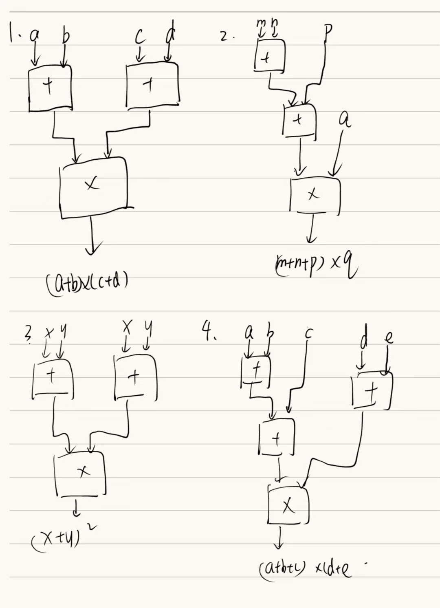

# HW1
## T1
### 1 .
10011001
01001100
### 2.
54
-19
## T2
### 1.
最小：-128
最大：127
### 2
-2^N-1^     ~2^N-1^-1          
 ## T3
 ### 1.
 -64
 ## T4
 ### 1.
 a+b大于2^31^-1
 ### 2.
 始终输出Sum is non-negative
 ## T5
 13
 ## T6
 最小数：1 11111110 11111111111111111111
 最小正数：0 00000000 0000000000000000001
 ## T7
 -835414802 ,0,1318926965
 ## T8
 ### 1
 *a-*b
 *a-*b
 ### 2
 存在，当a，b指向同一个元素，该元素会被破坏为0；
 修正：调用前加上判断，判断这两个数是不是相等，不相等再输入swap
 ## T9
 
 ## T10
 ### 1
 6
 ### 2
 6N
 ### 3
 001000  110110 101100 111110 110110 110100 110110 111001 111111